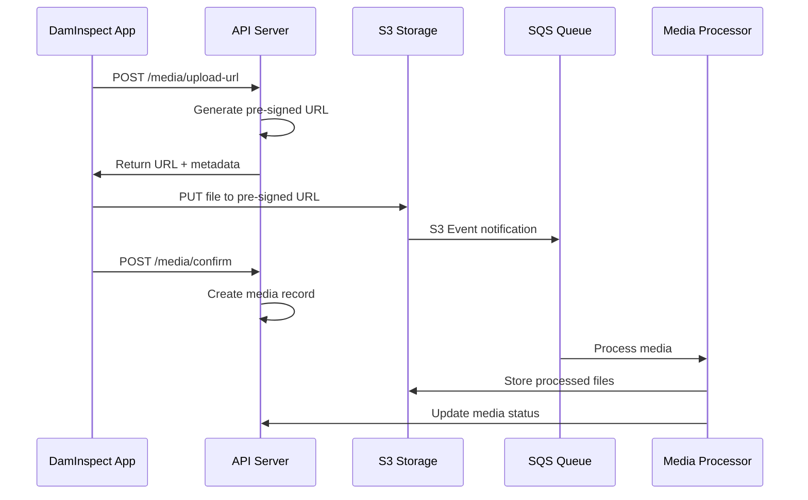

# 03 – File Storage & Media Management

## Overview
This document details the complete file storage architecture for the DamSafety.IO Inspections module, covering storage strategies, security, processing pipelines, and optimization techniques.

## Storage Architecture

### Primary Storage: AWS S3
- **Production Bucket**: `damsafety-inspections-prod`
- **Staging Bucket**: `damsafety-inspections-staging`
- **Region**: `us-west-2` (with CloudFront CDN)
- **Redundancy**: Cross-region replication to `us-east-1`

### Bucket Structure
```
damsafety-inspections-prod/
├── {damId}/
│   ├── inspections/
│   │   ├── {inspectionId}/
│   │   │   ├── media/
│   │   │   │   ├── photos/
│   │   │   │   │   ├── {mediaId}_original.jpg
│   │   │   │   │   ├── {mediaId}_thumb.jpg
│   │   │   │   │   ├── {mediaId}_medium.jpg
│   │   │   │   │   └── {mediaId}_annotated.jpg
│   │   │   │   ├── videos/
│   │   │   │   │   ├── {mediaId}_original.mp4
│   │   │   │   │   ├── {mediaId}_720p.mp4
│   │   │   │   │   ├── {mediaId}_poster.jpg
│   │   │   │   │   └── {mediaId}_timeline.vtt
│   │   │   │   └── documents/
│   │   │   │       └── {mediaId}.pdf
│   │   │   ├── reports/
│   │   │   │   ├── inspection_report_{timestamp}.pdf
│   │   │   │   └── inspection_summary_{timestamp}.pdf
│   │   │   └── exports/
│   │   │       ├── inspection_data_{timestamp}.json
│   │   │       └── inspection_package_{timestamp}.zip
│   │   └── historical/
│   │       └── {year}/
│   │           └── {inspectionNumber}.pdf
│   └── temp/
│       └── {uploadSessionId}/
│           └── {partNumber}
```

## Storage Classes & Lifecycle

### Immediate Access (STANDARD)
- Current year inspections
- All thumbnails and processed media
- Active inspection reports

### Infrequent Access (STANDARD_IA)
- Inspections 1-3 years old
- Original media files after processing
- Historical reports

### Archive (GLACIER)
- Inspections 3-5 years old
- Compliance archive copies

### Deep Archive (DEEP_ARCHIVE)
- Inspections >5 years old
- Regulatory compliance (30-year retention)

### Lifecycle Policy
```json
{
  "Rules": [
    {
      "Id": "TransitionToIA",
      "Status": "Enabled",
      "Transitions": [
        {
          "Days": 365,
          "StorageClass": "STANDARD_IA"
        }
      ],
      "Filter": {
        "Prefix": "*/inspections/*/media/photos/*_original"
      }
    },
    {
      "Id": "TransitionToGlacier",
      "Status": "Enabled",
      "Transitions": [
        {
          "Days": 1095,
          "StorageClass": "GLACIER"
        }
      ],
      "Filter": {
        "Prefix": "*/inspections/"
      }
    },
    {
      "Id": "DeleteTempFiles",
      "Status": "Enabled",
      "Expiration": {
        "Days": 7
      },
      "Filter": {
        "Prefix": "*/temp/"
      }
    }
  ]
}
```

## Upload Process

### 1. Direct Upload Flow


### 2. Multipart Upload (Large Files)
For files >100MB, use multipart upload:

```typescript
// Initialize multipart upload
POST /api/media/multipart/init
{
  "fileName": "inspection_video.mp4",
  "fileSize": 524288000, // 500MB
  "mimeType": "video/mp4"
}

// Response
{
  "uploadId": "abc123",
  "partSize": 10485760, // 10MB parts
  "totalParts": 50,
  "urls": [
    {
      "partNumber": 1,
      "url": "https://s3.amazonaws.com/..."
    }
    // ... 50 parts
  ]
}
```

### 3. Resumable Uploads
Support for interrupted uploads from mobile devices:

```typescript
// Check upload status
GET /api/media/multipart/{uploadId}/status

// Response
{
  "uploadId": "abc123",
  "completedParts": [1, 2, 3, 5], // Part 4 missing
  "missingParts": [4, 6, 7, ...],
  "expiresAt": "2024-06-15T12:00:00Z"
}
```

## Security Configuration

### Bucket Policy
```json
{
  "Version": "2012-10-17",
  "Statement": [
    {
      "Sid": "DenyUnencryptedObjectUploads",
      "Effect": "Deny",
      "Principal": "*",
      "Action": "s3:PutObject",
      "Resource": "arn:aws:s3:::damsafety-inspections-prod/*",
      "Condition": {
        "StringNotEquals": {
          "s3:x-amz-server-side-encryption": "AES256"
        }
      }
    },
    {
      "Sid": "DenyInsecureConnections",
      "Effect": "Deny",
      "Principal": "*",
      "Action": "s3:*",
      "Resource": "arn:aws:s3:::damsafety-inspections-prod/*",
      "Condition": {
        "Bool": {
          "aws:SecureTransport": "false"
        }
      }
    }
  ]
}
```

### Encryption
- **At Rest**: SSE-S3 (AES-256)
- **In Transit**: TLS 1.2+
- **Client-Side**: Optional for sensitive documents

### Access Control
- **Bucket**: Private, no public access
- **Objects**: Bucket owner full control
- **Pre-signed URLs**: 15-minute expiry for uploads, 5-minute for downloads
- **CORS**: Configured for web app domains only

## Media Processing Pipeline

### Image Processing
1. **Validation**
   - File type verification
   - Malware scanning
   - EXIF data extraction

2. **Optimization**
   ```javascript
   const sizes = {
     thumbnail: { width: 150, height: 150, quality: 80 },
     small: { width: 480, height: 480, quality: 85 },
     medium: { width: 1024, height: 1024, quality: 90 },
     large: { width: 2048, height: 2048, quality: 95 }
   };
   ```

3. **Enhancement**
   - Auto-rotation based on EXIF
   - Color correction
   - Sharpening for web display

4. **AI Analysis**
   - Defect detection
   - Text extraction (OCR)
   - Object classification

### Video Processing
1. **Transcoding**
   ```json
   {
     "profiles": [
       {
         "name": "720p",
         "width": 1280,
         "height": 720,
         "bitrate": "2500k",
         "codec": "h264"
       },
       {
         "name": "480p",
         "width": 854,
         "height": 480,
         "bitrate": "1000k",
         "codec": "h264"
       }
     ]
   }
   ```

2. **Thumbnail Generation**
   - Poster frame at 0s, 5s, 10s
   - Timeline thumbnails every 10s
   - Motion detection keyframes

### Document Processing
1. **PDF Optimization**
   - Compression
   - Text layer extraction
   - Thumbnail generation
   - Page splitting for web viewer

## Content Delivery

### CloudFront CDN Configuration
```javascript
{
  "Origins": [{
    "DomainName": "damsafety-inspections-prod.s3.amazonaws.com",
    "S3OriginConfig": {
      "OriginAccessIdentity": "origin-access-identity/cloudfront/E1234567890"
    }
  }],
  "DefaultCacheBehavior": {
    "TargetOriginId": "S3-damsafety-inspections",
    "ViewerProtocolPolicy": "redirect-to-https",
    "AllowedMethods": ["GET", "HEAD", "OPTIONS"],
    "CachedMethods": ["GET", "HEAD"],
    "Compress": true,
    "DefaultTTL": 86400,
    "MaxTTL": 31536000
  },
  "CacheBehaviors": [
    {
      "PathPattern": "*/thumbnails/*",
      "DefaultTTL": 604800 // 7 days
    },
    {
      "PathPattern": "*/reports/*",
      "DefaultTTL": 3600 // 1 hour
    }
  ]
}
```

### Signed URLs
```typescript
// Generate CloudFront signed URL
function getSignedUrl(objectKey: string, expiryMinutes: number = 5) {
  const policy = {
    Statement: [{
      Resource: `https://cdn.damsafety.io/${objectKey}`,
      Condition: {
        DateLessThan: {
          "AWS:EpochTime": Math.floor(Date.now() / 1000) + (expiryMinutes * 60)
        }
      }
    }]
  };
  
  return cloudfront.getSignedUrl({
    url: `https://cdn.damsafety.io/${objectKey}`,
    policy: JSON.stringify(policy),
    privateKey: process.env.CLOUDFRONT_PRIVATE_KEY,
    keyPairId: process.env.CLOUDFRONT_KEY_PAIR_ID
  });
}
```

## Backup & Recovery

### Backup Strategy
1. **Cross-Region Replication**
   - Real-time to us-east-1
   - Daily snapshots to Glacier

2. **Point-in-Time Recovery**
   - S3 Versioning enabled
   - 30-day version retention
   - MFA delete protection

3. **Disaster Recovery**
   ```bash
   # Recovery Time Objective (RTO): 4 hours
   # Recovery Point Objective (RPO): 1 hour
   ```

### Data Export
Monthly exports for compliance:
```typescript
// Automated export job
{
  schedule: "0 0 1 * *", // First day of month
  export: {
    format: "parquet",
    compression: "gzip",
    destination: "s3://damsafety-archive/exports/",
    partition: "year/month/day"
  }
}
```

## Cost Optimization

### Strategies
1. **Intelligent Tiering**
   - Automatic movement between access tiers
   - No retrieval fees
   - Monitoring via CloudWatch

2. **Request Optimization**
   - Batch operations for bulk processing
   - CloudFront caching for frequent access
   - S3 Transfer Acceleration for uploads

3. **Storage Optimization**
   - Compress before upload
   - Delete duplicate files
   - Expire temporary files

### Cost Monitoring
```sql
-- Monthly cost breakdown query
SELECT 
  storage_class,
  SUM(size_bytes) / 1024 / 1024 / 1024 as size_gb,
  COUNT(*) as object_count,
  SUM(size_bytes) / 1024 / 1024 / 1024 * 
    CASE storage_class
      WHEN 'STANDARD' THEN 0.023
      WHEN 'STANDARD_IA' THEN 0.0125
      WHEN 'GLACIER' THEN 0.004
    END as estimated_cost
FROM s3_inventory
GROUP BY storage_class;
```

## Monitoring & Alerts

### CloudWatch Metrics
```yaml
Alarms:
  - Name: HighUploadFailureRate
    Metric: 4xxErrors
    Threshold: 10
    Period: 300
    
  - Name: StorageQuotaExceeded
    Metric: BucketSizeBytes
    Threshold: 1099511627776 # 1TB
    
  - Name: UnusualAccessPattern
    Metric: GetRequests
    Threshold: 10000
    Period: 3600
```

### Logging
- **S3 Access Logs**: All requests logged
- **CloudTrail**: API calls and management events
- **Application Logs**: Upload/download events with context

## Compliance & Governance

### Data Retention Policy
| Data Type | Retention Period | Deletion Method |
|-----------|------------------|-----------------|
| Active Inspections | 5 years | Move to Archive |
| Archived Inspections | 30 years | Permanent deletion |
| Temporary Files | 7 days | Automatic expiry |
| Access Logs | 90 days | Automatic rotation |

### Compliance Features
1. **Audit Trail**: Immutable logs of all operations
2. **Legal Hold**: Prevent deletion of specific inspections
3. **Data Residency**: Ensure data stays in specified regions
4. **Encryption Keys**: Annual rotation with AWS KMS

### GDPR Compliance
```typescript
// Right to erasure implementation
async function deleteUserData(userId: string) {
  // 1. Anonymize metadata
  await anonymizeInspectionData(userId);
  
  // 2. Remove PII from filenames
  await sanitizeFileNames(userId);
  
  // 3. Update audit logs
  await logDataDeletion(userId);
}
``` 