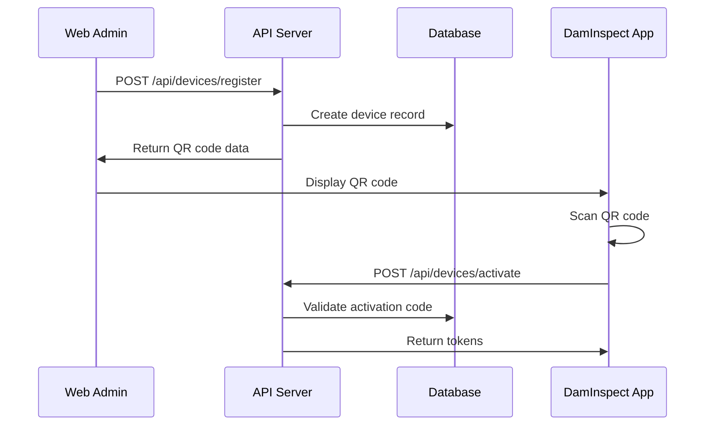

# 04 – Backend Authentication & Authorization

## Overview
This document details the authentication and authorization architecture for the DamSafety.IO Inspections module, covering web users, mobile devices, API integrations, and role-based access control.

## Authentication Methods

### 1. Web Dashboard Users (Azure AD B2C)
Existing authentication via NextAuth.js with Azure AD B2C provider.

```typescript
// Session cookie authentication
interface UserSession {
  user: {
    id: string;
    email: string;
    name: string;
    role: UserRole;
    organizationId: string;
    permissions: string[];
  };
  expires: string;
}
```

### 2. Mobile Device Authentication
Long-lived device tokens for DamInspect app with automatic refresh.

#### Device Registration Flow


#### Token Structure
```typescript
// Device Registration Request
POST /api/devices/register
{
  "deviceName": "John's iPhone",
  "organizationId": "org_123",
  "assignedDams": ["dam_123", "dam_456"],
  "permissions": ["inspection.create", "inspection.read"],
  "expiresAt": "2025-01-01T00:00:00Z"
}

// Device Token Payload
{
  "sub": "device:dev_abc123",
  "type": "device",
  "deviceId": "dev_abc123",
  "userId": "user_123", // Device owner
  "organizationId": "org_123",
  "permissions": [
    "inspection.create",
    "inspection.read",
    "media.upload"
  ],
  "dams": ["dam_123", "dam_456"],
  "iat": 1719331200,
  "exp": 1727107200, // 90 days
  "refresh": "refresh_token_xyz"
}
```

### 3. API Key Authentication
For server-to-server integrations and automated systems.

```typescript
// API Key Generation
POST /api/admin/api-keys
{
  "name": "Weather Data Integration",
  "permissions": ["inspection.read", "weather.write"],
  "ipWhitelist": ["192.168.1.0/24"],
  "expiresAt": "2025-01-01T00:00:00Z"
}

// Usage
Headers:
  X-API-Key: ak_live_abc123xyz
  X-API-Secret: as_live_secret456
```

## Authorization System

### Permission Model
Granular permissions with wildcards and inheritance.

```typescript
enum Permission {
  // Inspection permissions
  INSPECTION_CREATE = "inspection.create",
  INSPECTION_READ = "inspection.read",
  INSPECTION_UPDATE = "inspection.update",
  INSPECTION_DELETE = "inspection.delete",
  INSPECTION_APPROVE = "inspection.approve",
  INSPECTION_EXPORT = "inspection.export",
  
  // Observation permissions
  OBSERVATION_CREATE = "observation.create",
  OBSERVATION_READ = "observation.read",
  OBSERVATION_UPDATE = "observation.update",
  OBSERVATION_DELETE = "observation.delete",
  
  // Media permissions
  MEDIA_UPLOAD = "media.upload",
  MEDIA_VIEW = "media.view",
  MEDIA_DELETE = "media.delete",
  MEDIA_DOWNLOAD = "media.download",
  
  // Report permissions
  REPORT_GENERATE = "report.generate",
  REPORT_VIEW = "report.view",
  REPORT_EXPORT = "report.export",
  
  // Admin permissions
  DEVICE_MANAGE = "device.manage",
  USER_MANAGE = "user.manage",
  SETTINGS_MANAGE = "settings.manage"
}
```

### Role Definitions
```typescript
const rolePermissions: Record<UserRole, Permission[]> = {
  SUPER_ADMIN: ["*"], // All permissions
  
  ADMIN: [
    "inspection.*",
    "observation.*",
    "media.*",
    "report.*",
    "device.manage",
    "user.manage"
  ],
  
  MANAGER: [
    "inspection.*",
    "observation.*",
    "media.*",
    "report.*"
  ],
  
  ENGINEER: [
    "inspection.create",
    "inspection.read",
    "inspection.update",
    "observation.*",
    "media.*",
    "report.view"
  ],
  
  INSPECTOR: [
    "inspection.create",
    "inspection.read",
    "inspection.update:own", // Only own inspections
    "observation.*",
    "media.*"
  ],
  
  VIEWER: [
    "inspection.read",
    "observation.read",
    "media.view",
    "report.view"
  ],
  
  DEVICE: [
    "inspection.create",
    "inspection.read:assigned", // Only assigned dams
    "observation.create",
    "media.upload"
  ]
};
```

### Context-Based Permissions
Permissions can be scoped to specific contexts.

```typescript
interface PermissionContext {
  damId?: string;
  organizationId?: string;
  userId?: string;
  resourceId?: string;
  conditions?: {
    isOwner?: boolean;
    isAssigned?: boolean;
    status?: string[];
    timeRange?: {
      start: Date;
      end: Date;
    };
  };
}

// Example: Check if user can update inspection
async function canUpdateInspection(
  user: User,
  inspection: Inspection
): Promise<boolean> {
  // Super admins can always update
  if (hasPermission(user, "inspection.update", "*")) {
    return true;
  }
  
  // Check ownership condition
  if (hasPermission(user, "inspection.update:own")) {
    return inspection.inspectorId === user.id;
  }
  
  // Check organization context
  if (hasPermission(user, "inspection.update", {
    organizationId: inspection.organizationId
  })) {
    return user.organizationId === inspection.organizationId;
  }
  
  return false;
}
```

## Middleware Implementation

### Authentication Middleware
```typescript
// middleware/auth.ts
export async function requireAuth(
  req: NextRequest,
  options?: {
    allowDevice?: boolean;
    allowApiKey?: boolean;
  }
): Promise<AuthContext | null> {
  // 1. Check session cookie
  const session = await getServerSession(authOptions);
  if (session?.user) {
    return {
      type: 'user',
      user: session.user,
      permissions: await getUserPermissions(session.user.id)
    };
  }
  
  // 2. Check device token
  if (options?.allowDevice) {
    const deviceToken = req.headers.get('Authorization');
    if (deviceToken?.startsWith('Bearer device:')) {
      const device = await validateDeviceToken(deviceToken);
      if (device) {
        return {
          type: 'device',
          device,
          permissions: device.permissions
        };
      }
    }
  }
  
  // 3. Check API key
  if (options?.allowApiKey) {
    const apiKey = req.headers.get('X-API-Key');
    const apiSecret = req.headers.get('X-API-Secret');
    if (apiKey && apiSecret) {
      const client = await validateApiKey(apiKey, apiSecret);
      if (client) {
        return {
          type: 'api',
          client,
          permissions: client.permissions
        };
      }
    }
  }
  
  return null;
}
```

### Authorization Middleware
```typescript
// middleware/authorize.ts
export function requirePermission(
  permission: Permission | Permission[],
  context?: PermissionContext
) {
  return async (req: NextRequest) => {
    const auth = await requireAuth(req, {
      allowDevice: true,
      allowApiKey: true
    });
    
    if (!auth) {
      return NextResponse.json(
        { error: 'Unauthorized' },
        { status: 401 }
      );
    }
    
    const hasPermission = await checkPermission(
      auth,
      permission,
      context
    );
    
    if (!hasPermission) {
      return NextResponse.json(
        { error: 'Forbidden', required: permission },
        { status: 403 }
      );
    }
    
    // Add auth context to request
    (req as any).auth = auth;
    return NextResponse.next();
  };
}
```

## Token Management

### Token Generation
```typescript
// services/tokenService.ts
export class TokenService {
  // Generate device tokens
  async generateDeviceTokens(device: Device): Promise<TokenPair> {
    const accessToken = jwt.sign(
      {
        sub: `device:${device.id}`,
        type: 'device',
        deviceId: device.id,
        permissions: device.permissions,
        dams: device.assignedDams
      },
      process.env.JWT_SECRET,
      { expiresIn: '30m' }
    );
    
    const refreshToken = jwt.sign(
      {
        sub: `device:${device.id}`,
        type: 'refresh',
        deviceId: device.id
      },
      process.env.JWT_REFRESH_SECRET,
      { expiresIn: '90d' }
    );
    
    // Store refresh token
    await this.storeRefreshToken(device.id, refreshToken);
    
    return { accessToken, refreshToken };
  }
  
  // Refresh device token
  async refreshDeviceToken(refreshToken: string): Promise<TokenPair> {
    const payload = jwt.verify(
      refreshToken,
      process.env.JWT_REFRESH_SECRET
    );
    
    if (payload.type !== 'refresh') {
      throw new Error('Invalid refresh token');
    }
    
    // Validate stored token
    const isValid = await this.validateRefreshToken(
      payload.deviceId,
      refreshToken
    );
    
    if (!isValid) {
      throw new Error('Refresh token revoked');
    }
    
    // Generate new tokens
    const device = await this.getDevice(payload.deviceId);
    return this.generateDeviceTokens(device);
  }
}
```

### Token Storage
```prisma
model DeviceToken {
  id           String   @id @default(cuid())
  deviceId     String
  token        String   @unique
  type         String   // access | refresh
  issuedAt     DateTime @default(now())
  expiresAt    DateTime
  lastUsedAt   DateTime?
  revokedAt    DateTime?
  revokedBy    String?
  
  device       Device   @relation(fields: [deviceId], references: [id])
  
  @@index([deviceId, type])
  @@index([token])
  @@index([expiresAt])
}
```

## Security Measures

### Rate Limiting
```typescript
const rateLimits = {
  login: { window: '15m', max: 5 },
  deviceActivation: { window: '1h', max: 3 },
  tokenRefresh: { window: '5m', max: 10 },
  apiKey: { window: '1m', max: 100 }
};
```

### Token Security
1. **Rotation**: Refresh tokens rotated on use
2. **Binding**: Device tokens bound to device fingerprint
3. **Revocation**: Immediate revocation capability
4. **Monitoring**: Anomaly detection for token usage

### Audit Logging
```typescript
interface AuthAuditLog {
  id: string;
  timestamp: Date;
  authType: 'user' | 'device' | 'api';
  entityId: string;
  action: 'login' | 'logout' | 'refresh' | 'revoke';
  success: boolean;
  ipAddress: string;
  userAgent: string;
  metadata: {
    reason?: string;
    deviceFingerprint?: string;
    geoLocation?: GeoLocation;
  };
}
``` 